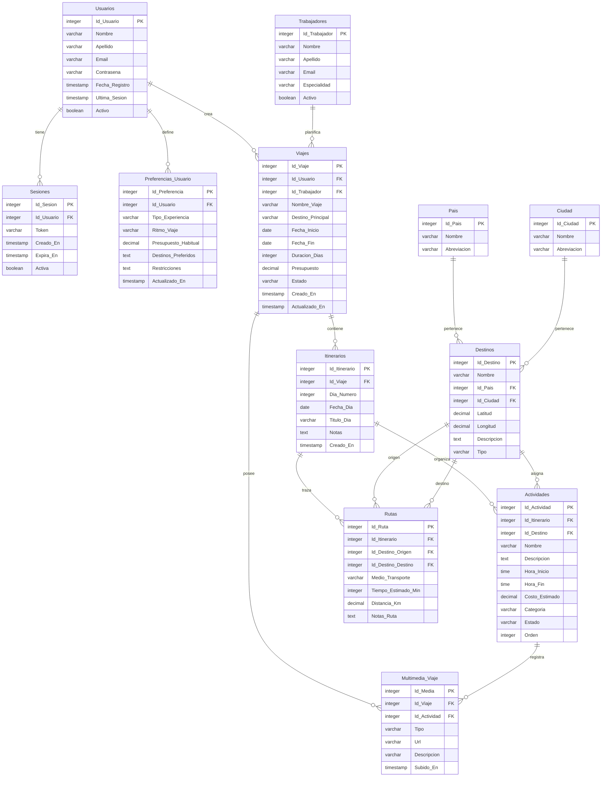

# 💻 Proyecto: Aplicación Web - Plan de Viajes

Esta carpeta contiene el código fuente de la plataforma web **Plan de Viajes**, una aplicación estática y responsive diseñada para centralizar la planificación de itinerarios turísticos.

---

## 🛠️ Tecnologías y Librerías Utilizadas

El desarrollo del frontend y la lógica de integración se apoyan en las siguientes tecnologías:

* **HTML5:** Estructuración semántica y modular de las diferentes vistas.
* **CSS3 (`css/styles.css`):** Definición de la identidad visual, paleta de colores moderna, tipografías y adaptación responsive personalizada.
* **Bootstrap v5.3.3 (CDN):** Sistema de grillas (grid), barras de navegación, botones, tarjetas (cards) y componentes web adaptables.
* **Vanilla JavaScript:** Control de interacciones del usuario, enrutamiento local, manipulación del DOM y consumo asíncrono de APIs.
* **Font Awesome v4.7.0 (CDN):** Iconografía vectorial para mejorar la experiencia visual de la interfaz.
* **Supabase Client Library (CDN):** Conector oficial de JavaScript que permite la interacción en tiempo real con la base de datos PostgreSQL remota y el manejo de la autenticación.

---

## 🗄️ Estructura de la Base de Datos (Supabase)

La persistencia de información en la nube se administra mediante una base de datos relacional PostgreSQL provista por Supabase. A continuación se presenta el diagrama de entidad-relación y la descripción de las tablas:

### Diagrama de Entidad-Relación (MER)



### Detalle de las Tablas Principales

1. **Usuarios:** Almacena los perfiles registrados, contraseñas encriptadas y el estado de la cuenta.
2. **Viajes:** Representa la entidad central creada por un usuario (asociada opcionalmente a un trabajador que ayuda en la planificación).
3. **Itinerarios y Actividades:** Organizan cronológicamente los días del viaje y las acciones puntuales en cada destino (visitas, comidas, etc.) con sus respectivos horarios y costos.
4. **Rutas:** Mapea el traslado entre destinos dentro de un itinerario, especificando el transporte, distancias y tiempos.
5. **Preferencias_Usuario:** Perfil cognitivo del viajero que ayuda a personalizar las futuras sugerencias de viajes.

---

## 📁 Estructura de Archivos del Proyecto

* 📄 `index.html` - Página de aterrizaje (Landing Page) y punto de entrada de la aplicación.
* 📁 `css/`
  * 📄 `styles.css` - Estilos globales de la aplicación web.
* 📁 `js/`
  * 📄 `supabase-config.js` - Inicialización de Supabase con las credenciales públicas del proyecto y prueba de conexión.
  * 📄 `script.js` - Lógica de enrutamiento, interacción con Supabase y manejo del estado de los formularios.
* 📁 `html's/` - Vistas y pantallas específicas de la plataforma:
  * 📄 `log_in.html` - Formulario de inicio de sesión de usuario.
  * 📄 `sing_up.html` - Formulario de registro para nuevos usuarios.
  * 📄 `travels.html` - Panel de control con la lista de viajes del usuario ("Mis Viajes").
  * 📄 `make_travel.html` - Formulario para definir las características y crear un nuevo viaje.
  * 📄 `itinerario.html` - Vista del cronograma diario y actividades del viaje seleccionado.
  * 📄 `lugares.html` - Explorador de destinos turísticos y puntos de interés.
  * 📄 `presupuesto.html` - Gestor financiero y control de gastos del viaje.
  * 📄 `prices.html` - Información sobre planes de pago y niveles de servicio premium.
  * 📄 `share.html` - Opciones para compartir el viaje planificado con otros usuarios o amigos.
  * 📄 `explore.html` - Buscador global e inspiración de destinos populares.
  * 📄 `finished_travels.html` - Historial de itinerarios ya completados.
  * 📄 `final_settings.html` - Pantalla de ajustes finales y configuración de la experiencia de viaje.
  * 📄 `info.html` - Página informativa de ayuda y contacto.
* 📁 `Imagenes/` - Recursos visuales de la aplicación (iconos, imágenes estáticas, etc.).
* 📄 `update_links.py` - Script utilitario de Python para automatizar la corrección de enlaces de navegación en múltiples archivos HTML.

---

## 🚀 Guía de Ejecución

Para iniciar la aplicación web en tu entorno local (ya sea clonando el repositorio o extrayendo el archivo `.zip`):

### Paso 1: Obtener el Código
Si descargaste el archivo `.zip`, descomprímelo en una carpeta de tu preferencia. Si estás utilizando Git, clona el repositorio con:
```bash
git clone https://github.com/SantinoRodriguez/Plan-De-Viajes.git
```

### Paso 2: Ejecutar el Backend (FastAPI)

Para que las secciones de **Mis Viajes**, **Viajes Realizados** y **Recuerdos** puedan cargar la información correctamente desde Supabase, debes levantar el backend en Python:

1. Asegúrate de estar en el directorio `Proyecto` y de tener instalado Python.
2. Instala las dependencias necesarias ejecutando:
   ```bash
   pip install -r requirements.txt
   ```
   *Nota: Si no posees el archivo `requirements.txt`, puedes instalar las librerías manualmente con:*
   ```bash
   pip install fastapi "uvicorn[standard]" pydantic supabase
   ```
3. Inicia el servidor de desarrollo de FastAPI con el siguiente comando:
   ```bash
   python -m uvicorn main:app --reload
   ```
   *El servidor backend se ejecutará en `http://localhost:8000` y está configurado con CORS para interactuar con tu frontend.*

### Paso 3: Ejecutar el Frontend

Para visualizar la aplicación web, puedes elegir una de las siguientes opciones:

#### Opción 1: Abrir Directamente (Sin instalación)
Ingresa a la carpeta `Proyecto` y haz doble clic en `index.html`. El sitio se cargará directamente en tu navegador web.

#### Opción 2: Usar un Servidor Local (Recomendado)
Para evitar problemas de carga de archivos externos o políticas de origen local (`CORS`), abre una consola en la carpeta `Proyecto` y ejecuta uno de los siguientes comandos:

* **Si usas Python:**
  ```bash
  python -m http.server 3000
  ```
  Luego accede a: `http://localhost:3000`

* **Si usas Node.js (npm):**
  ```bash
  npx serve
  ```
  Luego accede a la dirección web que se indique en la terminal.

* **Si usas la extensión "Live Server" en VS Code:**
  Haz clic en el botón **"Go Live"** en la esquina inferior derecha mientras visualizas `index.html`.

### Paso 4: Validar la conexión con la base de datos
1. Abre tu navegador web en la aplicación.
2. Presiona `F12` (o haz clic derecho y selecciona *Inspeccionar*) y ve a la pestaña **Consola**.
3. Deberías ver un mensaje como: `Conexión exitosa a Supabase...`. Esto confirma que las credenciales integradas en `js/supabase-config.js` se están comunicando correctamente con la base de datos remota PostgreSQL.
4. Asegúrate de que el backend de FastAPI en el puerto 8000 esté encendido para que las llamadas de consulta a tus viajes y recuerdos funcionen correctamente.
